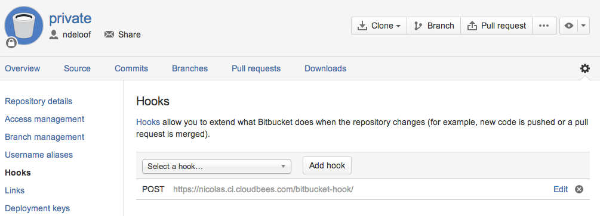

Bitbucket Plugin for Jenkins
============================

[](https://ci.jenkins.io/job/Plugins/job/bitbucket-plugin/job/master/)
[](https://plugins.jenkins.io/bitbucket/)
[](https://github.com/jenkinsci/bitbucket-plugin/releases/latest/)
[](https://plugins.jenkins.io/bitbucket/)

## About

Bitbucket plugin is designed to offer integration between Bitbucket and Jenkins.

It exposes a single URI endpoint that you can add as a WebHook within each Bitbucket project you wish to integrate with. This single endpoint receives a full data payload from Bitbucket upon push (see their documentation), triggering compatible jobs to build based on changed repository/branch.

Since 1.1.5 Bitbucket automatically injects the payload received by Bitbucket into the build. You can catch the payload to process it accordingly through the environmental variable $BITBUCKET\_PAYLOAD.

  

## Bitbucket Cloud usage

Configure your Bitbucket repository with a [Webhook](https://confluence.atlassian.com/bitbucket/manage-webhooks-735643732.html), using URL JENKINS\_URL/bitbucket-hook/ (no need for credentials but do remember the trailing slash).


The older-style HTTP POSTs from Bitbucket are also supported but deprecated.



On each push, the plugin:

1.  Scans Jenkins for all jobs with "Build when a change is pushed to Bitbucket" option enabled. For MultiBranch pipelines `Scan Multibranch Pipeline Triggers` should be configured in order to be able to process the WebHook.
2.  For each job matched:
    1.  If the job's SCM (git) URL "loosely matches" that of the git repository listed inside the Bitbucket-provided payload, AND
    2.  If the job's SCM (git) detects that the remote repository has changes, THEN
    3.  A full build of the job will be queued

The "loose matching" is based on the host name and paths of the projects matching.


## Bitbucket server usage

Since the version 1.1.7 of the Bitbucket plugin works against Bitbucket server. For this plugin to work against Bitbucket server you must: 

1.  Install [Post Webhooks for Bitbucket](https://marketplace.atlassian.com/plugins/nl.topicus.bitbucket.bitbucket-webhooks/server/overview) at Bitbucket side \[the plugin is free\]
2.  At repository level, delete the webhook in case it exists


3. Create a Post-WebHook, which is different from WebHook and enable on push.


After this, you are all set-up

## Override Repository URL


In case the matching mechanism does not work, you can manually override the URL used for matching.  
For example:  
The URL https://bitbucket.org/tzachs/my_repo.git.git would be tried to matched with https://bitbucket.org/tzachs/my_repo.git. This of course would fail.  
To overcome this, setting the "Override Repository URL" field to https://bitbucket.org/tzachs/my_repo.git would match the URL and will trigger the JOB when a commit is pushed to my_repo.git.git

## Job DSL

The current supported dsl is as follows:

``` syntaxhighlighter-pre
freeStyleJob('test-job') {
  triggers{
    bitbucketPush()
  }
}
```

### Job DSL example for overrideUrl
```
triggers{
  bitbucketPush overrideUrl: 'https://bitbucket.org/blabla/hello-world-server'
}
```

**Changelog**
#### 1.1.30 (20. Nov 2021)

- JENKINS-49414 - Added ability to trigger the job upon receiving a branch was created event

#### 1.1.29 (27. May 2021)

- Changed help of multibranch according to https://issues.jenkins.io/browse/JENKINS-65651?focusedCommentId=409435&page=com.atlassian.jira.plugin.system.issuetabpanels%3Acomment-tabpanel#comment-409435

#### 1.1.28 (19. May 2021)

- JENKINS-65651 - Added option to override URL in multi branch jobs

#### 1.1.27 (11. October 2020)

- Fixed logging printing

#### 1.1.26 (10. October 2020)

- Added logging for JENKINS-63848

#### 1.1.25 (8. September 2020)

- [JENKINS-63468 - Bitbucket plugin unable to parse push/test connection bitbucket webhook json payload](https://issues.jenkins-ci.org/browse/JENKINS-63468)

#### 1.1.24 (31. August 2020)

- [PR-68 - New Branch: Scan multibranch pipeline log](https://github.com/jenkinsci/bitbucket-plugin/pull/68)

#### 1.1.23 (29. August 2020)

- [PR-65 - Ignore payload processing for diagnostics:ping](https://github.com/jenkinsci/bitbucket-plugin/pull/65)  

#### 1.1.21 (28. August 2020)

- [JENKINS-63374 - Bitbucket plugin changed API for the bitbucketPush trigger in an incompatible way](https://issues.jenkins-ci.org/browse/JENKINS-63374)

#### 1.1.20 (12. August 2020)

- [PR-69 - Show what project is triggered not just branch](https://github.com/jenkinsci/bitbucket-plugin/pull/69)

#### 1.1.19 (08. August 2020)

- Added ability to override Repository URL which used for matching

#### 1.1.18 (04. August 2020)

- [PR-61 - Fixing a typo, adding message re 'Test connection'](https://github.com/jenkinsci/bitbucket-plugin/pull/61) 


#### 1.1.17 (04. August 2020)

- Changed repos to use HTTPS as suggested by JLLeitschuh in PR #70

#### 1.1.16 (30. July 2020)

- Fixed spotbugs errors

#### 1.1.15  (29. July 2020)

- Fixed javadoc error preventing from releasing 1.1.14

#### 1.1.14 (Not released)

- Fixed CVE-2020-5529
- Updated to jenkins version to 2.204.1 

#### 1.1.13 (26. July 2020)

-  See [PR-75](https://github.com/jenkinsci/bitbucket-plugin/pull/75), supporting repos that end with .git

#### 1.1.12 (Not released)

#### 1.1.11 (27. August 2019)

-   Added possibility to process trigger from bitbucket server default webhooks [PR-63](https://github.com/jenkinsci/bitbucket-plugin/pull/63) 

#### 1.1.10 (4. July 2019)

-   Update job-dsl dependency to 1.66.
    See [PR-58](https://github.com/jenkinsci/bitbucket-plugin/pull/58) 

#### 1.1.9 (1. Jun 2019)

-   Address [Bitbucket API change](https://developer.atlassian.com/cloud/bitbucket/bitbucket-api-changes-gdpr/?_ga=2.164415676.2088283489.1559219877-1322535506.1557927444): 
    [JENKINS-57787](https://issues.jenkins-ci.org/browse/JENKINS-57787)
    - Getting issue details... STATUS

#### 1.1.7 (6. Dec 2017)

-   Add Jenkins ci integration
-   [JENKINS-28877](https://issues.jenkins-ci.org/browse/JENKINS-28877) :
    Add integration for Bitbucket server

#### 1.1.6 (2. Nov 2017)

-   fix 
    [JENKINS-44309](https://issues.jenkins-ci.org/browse/JENKINS-44309) 
    Add support for Symbol

#### 1.1.5 (26. Jan 2016)

-   fix
    [JENKINS-32372](https://issues.jenkins-ci.org/browse/JENKINS-32372)
    Inject the Payload into the build through $BITBUCKET\_PAYLOAD

#### 1.1.4 (28. Dec 2015)

-   Add
    [JENKINS-31185](https://issues.jenkins-ci.org/browse/JENKINS-31185) hg
    support
-   Add [Job DSL extension](https://github.com/jenkinsci/bitbucket-plugin/pull/24)
-   fix
    [JENKINS-26234](https://issues.jenkins-ci.org/browse/JENKINS-26234)
    CSRF support

#### 1.1.3 (16. Oct 2015)

-   fix
    [JENKINS-29096](https://issues.jenkins-ci.org/browse/JENKINS-29096)
    Advice users when they don't use the right hook url - last \`/\`
-   fix
    [JENKINS-30985](https://issues.jenkins-ci.org/browse/JENKINS-30985)
    Jobs with the same git repository defined several times in the scm should be triggered only once

#### 1.1.2 (4. August 2015)

-   fix
    [JENKINS-28882](https://issues.jenkins-ci.org/browse/JENKINS-28882)
    Workflow support for BitBucket trigger

#### 1.1.1 (9. July 2015)

-   Allow Webhooks 2.0

#### 1.1.0 (10. March 2015)

-   fix
    [JENKINS-24999](https://issues.jenkins-ci.org/browse/JENKINS-24999)
    Build triggered by SCM change without activating trigger in the job configuration
-   fix
    [JENKINS-26413](https://issues.jenkins-ci.org/browse/JENKINS-26413)
    BitBucket trigger doesn't need to Initialize LogFile
-   fix
    [JENKINS-26489](https://issues.jenkins-ci.org/browse/JENKINS-26489)
    Action report for the bitbucket polling log on web UI
-   fix
    [JENKINS-26805](https://issues.jenkins-ci.org/browse/JENKINS-26805)
    Job is not triggered after merging a branch

#### 1.0

-   initial implementation
